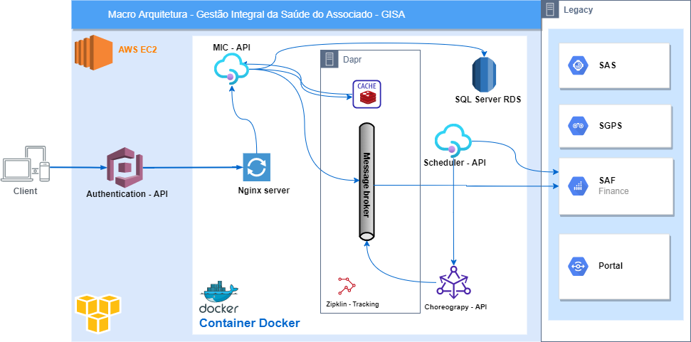
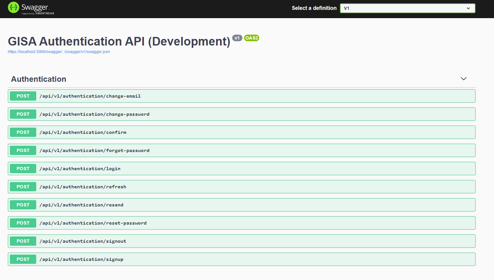

# TCC - Protótipo de arquitetura de sistemas distribuídos - GISA

<h3> GISA - Gestão Integral da Saúde do Associado </h3>

# Macro Arquitetura

# Entrypoints:

GISA - Authentication - Api de autenticação com [AWS Cognito](https://aws.amazon.com/pt/cognito).

### 👉 1. Authentication

### 👉 2. Módulo de informaçoes cadastrais.

### 👉 3. Api de agendamento de consultas

## Dúvidas:

- Entre em contato pelo e-mail: jorge.higor@gmail.com
